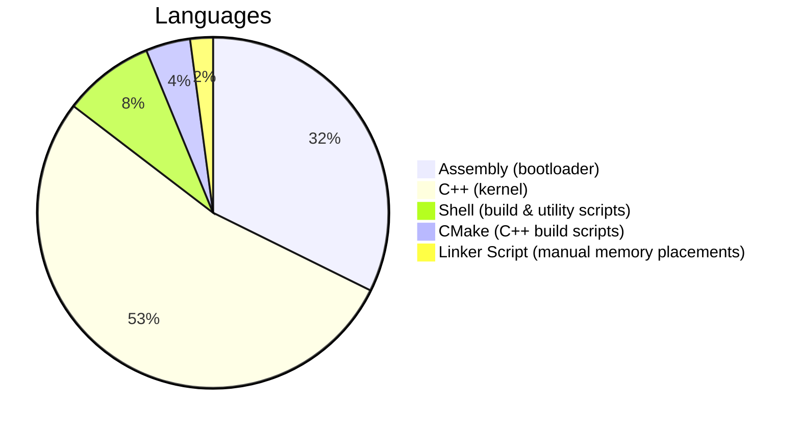

# Lexvi

> ⚠️ **Hobby Project Notice:** Lexvi is a passion project built for the love of low-level programming. It is in no way trying to compete with Linux, macOS, or Windows. It's simply a fun exploration of what it takes to build an OS from the ground up.

## About

Lexvi is an OS built from scratch, primarily written in **Assembly** and **C++**. It is a bare-metal project, no OS abstraction layers, no frameworks, simply raw hardware interaction.

The project is **open source**. Contributions, forks, and experiments are welcome.



---

## Building

### Prerequisites

The build system relies on the following tools:

- `nasm` - Netwide Assembler, for compiling the Assembly portions
- `dd` - for writing the binary image
- `cat` - for concatenating binary blobs
- `cmake` + a C++ compiler (e.g. `g++ or clang++`)

These tools come **pre-installed or are easily available on most Linux systems**, making Linux the recommended build environment.

> **Windows users:** A Windows port is entirely feasible in the near future, only the `build.sh` script would need to be adapted (e.g. using PowerShell or WSL equivalents). The core C++ and Assembly source is platform-agnostic.

### Running the Build

```bash
./scripts/build.sh
```

By default, this produces a **virtual disk image (`.img`)** file. The build script automatically calculates the correct padding and sector counts for bootloader and kernel loading, you don't need to configure these manually.

> **Note:** The build process runs **twice** as part of the offset calculation. You will see two CMake build outputs in your terminal, this is completely normal and expected.

---

## Extending the Kernel

Since the project uses **CMake** as its build system, adding new kernel components is straightforward:

1. Write your `.cpp` (or `.asm`) file and place it in the appropriate source directory.
2. Add it to `CMakeLists.txt`.
3. Re-run `./scripts/build.sh`.

That's it! No complex makefile archaeology required.

---

## Memory Layout & Linker Script

Lexvi manually controls its own memory layout via a **custom linker script**. This means:

- The exact placement of the bootloader, kernel, and stack in memory is explicitly defined.
- There is no OS to manage virtual memory on our behalf — every address is intentional.
- Sections like `.text`, `.data`, `.bss`, and `.rodata` are mapped by hand.

This is one of the more technically demanding aspects of OS development, and it keeps the system lean and fully transparent.

---

## Running Lexvi

### QEMU (Recommended)

QEMU works out of the box with the generated `.img` file:

```bash
qemu-system-i386 -drive format=raw,file=build/lexvi.img
```

No extra setup needed.

### VirtualBox

VirtualBox requires a `.vdi` (Virtual Disk Image) rather than a raw `.img`. The included `vboxAttach.sh` script handles the conversion and attachment automatically, **however it requires configuration before first use.**

Open `vboxAttach.sh` and update the following variables to match your VirtualBox setup:

- The **UUID** of your VM
- The **name of your virtual machine**
- The **name of the HDD** to attach to

Once configured, running the script will generate the correct `.vdi` and attach it to your VM.

```bash
./scripts/vboxAttach.sh
```

> Do not run `vboxAttach.sh` without editing these variables first, it will not know which machine or disk to target.

---

## License

Open source. See repository for license details.
