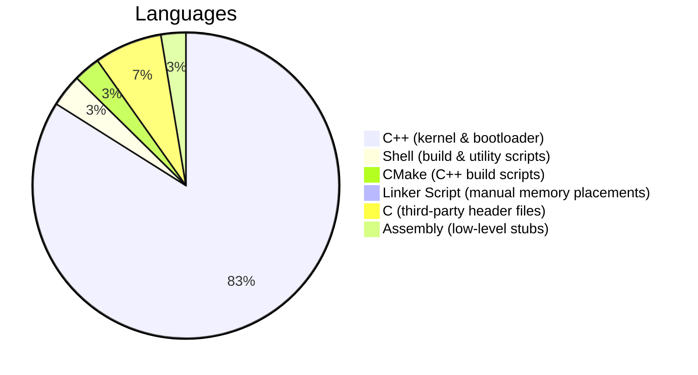

# Lexvi

> ⚠️ **Hobby Project Notice:** Lexvi is a passion project built for the love of low-level programming. It is in no way trying to compete with Linux, macOS, or Windows. It's simply a fun exploration of what it takes to build an OS from the ground up.

## About

Lexvi is an OS built from scratch, primarily written in **Assembly** and **C++**. It is a bare-metal project, no OS abstraction layers, no frameworks, simply raw hardware interaction.
The project is **open source**. Contributions, forks, and experiments are welcome.


*Early Test on old Dell Inspiron 15*

---


```mermaid
pie title Languages
    "C++ (kernel & bootloader)" : 83.2
    "Shell (build & utility scripts)" : 3.4
    "CMake (C++ build scripts)" : 2.8
    "Linker Script (manual memory placements)" : 0.9
    "C (third-party header files)" : 7.1
    "Assembly (low-level stubs)" : 2.6
```

---

## Boot Architecture

Lexvi boots via **UEFI**, not legacy BIOS. `BOOTX64.EFI` is a PE32+ application built against `gnu-efi` headers — used purely for convenience (structs, calling conventions), not as an abstraction framework. The bootloader itself still does everything by hand: memory map retrieval, ACPI table discovery, and page table setup are all explicit.

Key pieces:

- **`src/boot-uefi/main.cpp`** — the UEFI entry point, compiled separately from the kernel's CMake build
- **`elf_x86_64_efi.lds`** + **`objcopy`** — link the bootloader as an ELF, then convert to a PE32+ image UEFI firmware can load
- **`EFI_MEMORY_DESCRIPTOR`** — replaces the old E820 memory map
- **GOP framebuffer** — replaces VGA text mode
- **RSDP via `ConfigurationTable`** — replaces EBDA scanning
- **`KernelBootInfo`** — a struct handed from bootloader to kernel, replacing fixed physical address constants

The legacy two-stage NASM BIOS bootloader has been retired from the active build and lives on in the `legacy` branch.

---

## Building

### Prerequisites

- `nasm` — for any remaining low-level assembly stubs
- `gnu-efi` headers — for building the UEFI bootloader
- `objcopy` — converts the linked ELF into a PE32+ `.efi` image
- `dd` — for writing the disk image
- `cmake` + a C++ compiler (e.g. `g++` or `clang++`)
- `ovmf` — pre-built OVMF CODE/VARS firmware pair, for testing under QEMU

> **OVMF note:** Use your distro's `ovmf` package for a matched CODE/VARS pair. Hand-rolled vars files (zero-filled or `0xFF`-filled) will fail firmware volume validation — only pre-built pairs are known-good.

These tools are pre-installed or easily available on most Linux systems, making Linux (or WSL on Windows) the recommended build environment.

### Running the Build

```bash
./scripts/build.sh
```

This produces a bootable disk/USB image with an EFI System Partition containing `BOOTX64.EFI`, alongside the compiled kernel.

---

## Extending the Kernel

Since the project uses **CMake** as its build system, adding new kernel components is straightforward:

1. Write your `.cpp` (or `.asm`) file and place it in the appropriate source directory.
2. Add it to `CMakeLists.txt`.
3. Re-run `./scripts/build.sh`.

That's it! No complex makefile archaeology required.

---

## Memory Layout & Linker Script

Lexvi manually controls its own memory layout via custom linker scripts. This means:

- The exact placement of the bootloader, kernel, and stack in memory is explicitly defined.
- There is no OS to manage virtual memory on our behalf — every address is intentional.
- Sections like `.text`, `.data`, `.bss`, and `.rodata` are mapped by hand.
- Physical memory is requested through UEFI's `AllocatePages` / `AllocatePool` rather than fixed scratch addresses — a deliberate departure from the old BIOS-era approach of hardcoding scratch addresses like `0x7000`, which cannot be assumed safe once BIOS's fixed-address guarantees are gone.

This is one of the more technically demanding aspects of OS development, and it keeps the system lean and fully transparent.

---

## Running Lexvi

### QEMU (Recommended)

QEMU works out of the box with OVMF firmware:

```bash
qemu-system-x86_64 \
    -drive if=pflash,format=raw,readonly=on,file=/usr/share/OVMF/OVMF_CODE.fd \
    -drive if=pflash,format=raw,file=/usr/share/OVMF/OVMF_VARS.fd \
    -drive format=raw,file=build/lexvi.img \
    -debugcon file:debug.log -global isa-debugcon.iobase=0x402
```

The `-debugcon` line routes early boot narration (before the kernel's own console is up) to `debug.log` — useful for diagnosing anything that goes wrong before serial/VGA output is available.

### Real Hardware

Since Lexvi now boots via standard UEFI, it can be written to a USB drive with an EFI System Partition and booted on real x86-64 hardware that supports UEFI boot, no BIOS compatibility mode required.

---

## License

Open source. See repository for license details.
